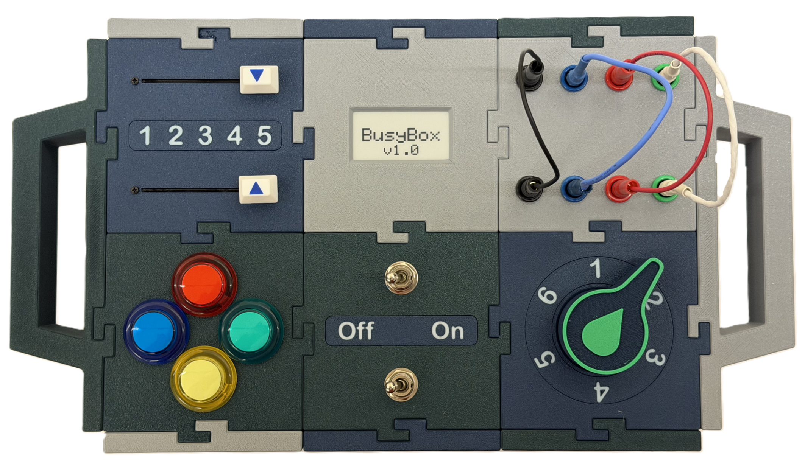

# BusyBox: Benchmarking Affordance Generalization

BusyBox is a physical 3D-printable device for benchmarking affordance generalization in robot foundation models.



It features

 - Modular design with 6 interchangeable modules (buttons, switches, sliders, wires, knob, and display)  
 - Open-source CAD files and bill of materials for easy reproduction  
 - Optional electronics and Raspberry Pi instrumentation for automated state logging  
 - Reconfigurable setups enabling systematic evaluation of generalization  
 - A language-annotated dataset of 1000+ demonstration trajectories oof BusyBox affordances  

Please check out our [website](https://microsoft.github.io/BusyBox/) for more details.

## BusyBox assembly instructions

For fully building a instrumented BusyBox capable of state logging, see the [BOM](BOM.md).

First print the BusyBox following [Printing Instructions](cad/printing_instructions.md) with details on files to print and any details on print settings.

## Electronic Assembly:

TODO: add instructions on how to assemble electronics with pictures

## Firmware Flashing:

Instructions for flashing the Arduino Nano's firmware: [Flashing Firmware](devices/flashing_firmware.md)

## Data Collection

See [Data Collection](assets/taskbox_data_collection.docx) for details on our data collection methodology.

### Recording Episodes with Aloha

The `robots/aloha/` directory contains a complete data recording pipeline for collecting teleoperated demonstrations using the [Aloha](https://github.com/tonyzhaozh/aloha) bimanual robot.

#### Prerequisites

- Aloha robot hardware (leader + follower arms) set up and calibrated
- USB foot pedal for episode control
- (Optional) Instrumented BusyBox with MQTT bridge for state logging

#### Quick Start

```bash
pip install -r requirements.txt
python robots/aloha/record_busybox_episodes.py
```

#### Foot Pedal Controls

| Pedal | Action |
|-------|--------|
| Left | Start recording |
| Middle | Stop and save episode / Refresh task prompt |
| Right | Pause/resume teleop / Reject recording |

#### Configuration

Edit `robots/aloha/utils/config.py` to set:
- `dataset_dir` — where episodes are saved
- `camera_names` — which cameras to record
- `using_instrumented_busybox` — enable MQTT state logging

#### Episode Data Format (HDF5)

Each episode is saved as an HDF5 file with:
- `/observations/qpos` — joint positions (14,) per timestep
- `/observations/qvel` — joint velocities (14,)
- `/observations/effort` — joint torques (14,)
- `/observations/images/{cam_name}` — JPEG-compressed camera frames
- `/action` — leader arm joint commands (14,)
- `/observations/timestamp`, `/action_timestamp` — timing data

#### Utility Scripts

| Script | Purpose |
|--------|---------|
| `scripts/count_episodes_collected_today.py` | Count episodes recorded in the current session |
| `scripts/busybox_calibration.py` | BusyBox sensor calibration |
| `scripts/visualize_hdf5.ipynb` | Visualize recorded episode data |
| `robots/aloha/eval_rollouts.py` | Evaluate policy rollouts |

### Raspberry Pi MQTT Bridge

For instrumented BusyBox setups, the `devices/pi_sw/` directory contains the MQTT bridge that runs on the Raspberry Pi:

```bash
# On the Raspberry Pi
pip install pyserial paho-mqtt
python devices/pi_sw/mqtt_bridge.py --broker-host <MQTT_BROKER_IP>
```

See [Flashing Firmware: Installing MQTT on the Pi](devices/flashing_firmware.md#6-installing-mqtt-on-the-pi) for setup details.
