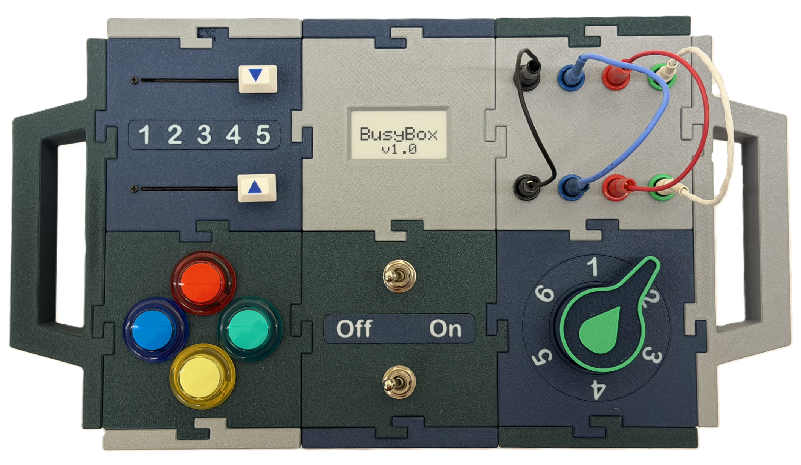

# BusyBox: Benchmarking Affordance Generalization

BusyBox is a physical 3D-printable device for benchmarking affordance generalization in robot foundation models.

It features

 - Modular design with 6 interchangeable modules (buttons, switches, sliders, wires, knob, and display)  
 - Open-source CAD files and bill of materials for easy reproduction  
 - Optional electronics and Raspberry Pi instrumentation for automated state logging  
 - Reconfigurable setups enabling systematic evaluation of generalization  
 - A language-annotated dataset of 1000+ demonstration trajectories oof BusyBox affordances  

Please check out our [website](https://microsoft.github.io/BusyBox/) for more details.

## BusyBox assembly instructions

For fully building a instrumented BusyBox capable of state logging, see the [BOM](BOM.md).

First print the BusyBox following [Printing Instructions](cad/printing_instructions.md) with details on files to print and any details on print settings.

## Electronic Assembly:

TODO: add instructions on how to assemble electronics with pictures

## Firmware Flashing:

Instructions for flashing the Arduino Nano's firmware: [Flashing Firmware](devices/flashing_firmware.md)

## Data Collection Guide

See [Data Collection](assets/taskbox_data_collection.docx) for a look into how we collected our data.
